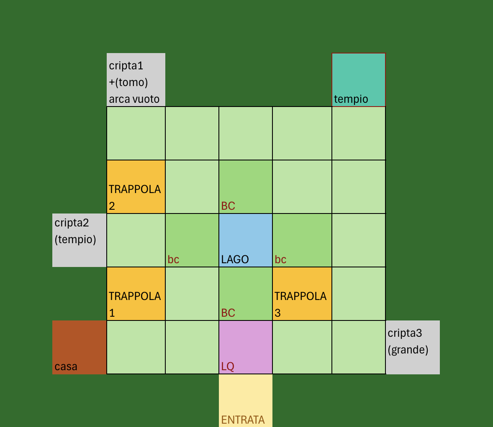
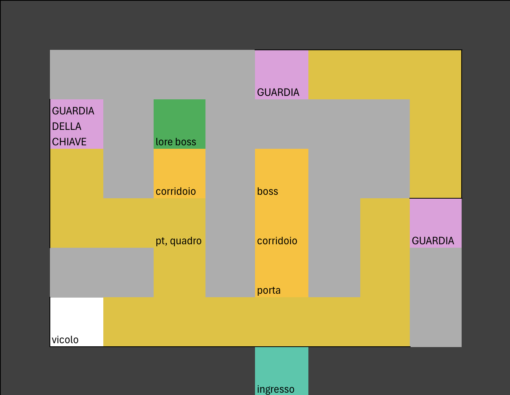
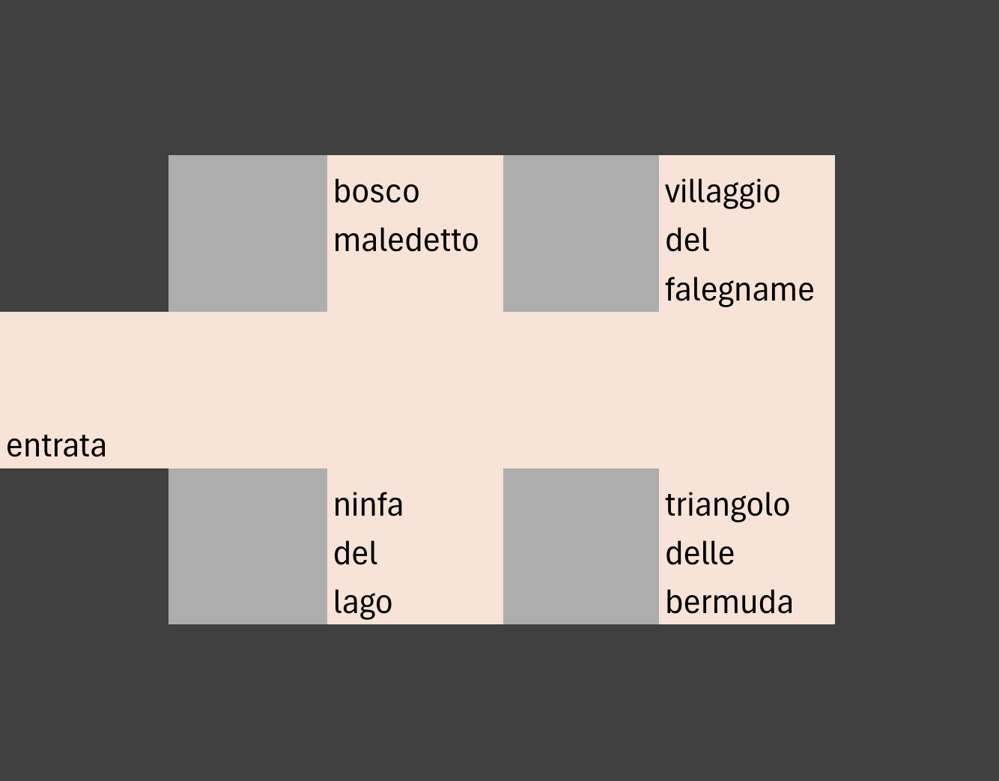

# The Last Bounty 
Avventura Testuale in JAVA

Progetto di : 
* [Miccoli Francesco Pio](https://github.com/Miccoli04)
* [Marzulli Leonardo Nicola](https://github.com/marzullidino)
* [Sivo Roberto](https://github.com/drROBotnik1803)

A.A.: 2024-2025 - Corso di Metodi Avanzati di Programmazione - Docente: Basile Pierpaolo

Università degli Studi di Bari Aldo Moro - Dipartimento di Informatica

## TRAMA
L'utente giocherà nei panni di un cacciatore di taglie, che per completare la sua ultima taglia rimane intrappolato in una foresta maledetta situata nel triangolo delle bermuda, la cui unica via d'uscita è quella di uccidere il famigerato mostro che si annida lì dentro.

## Intallazione del Programma
Il programma utilizza la JDK 21 è possibile scaricarla cliccando [qui](https://www.oracle.com/it/java/technologies/downloads/#java21)

è possibile scaricare l'ultima versione dei files del progetto clonando la repository github 
https://github.com/LumberjackTales/TheLastBounty

## Mappa del Gioco
Mappa del Bosco

Mappa del tempio

Mappa della terza cripta

## Soluzione del Gioco

[Clicca qui per visualizzare la Documentazione del progetto](./TheLastBounty/docs/documentazione.md
)
