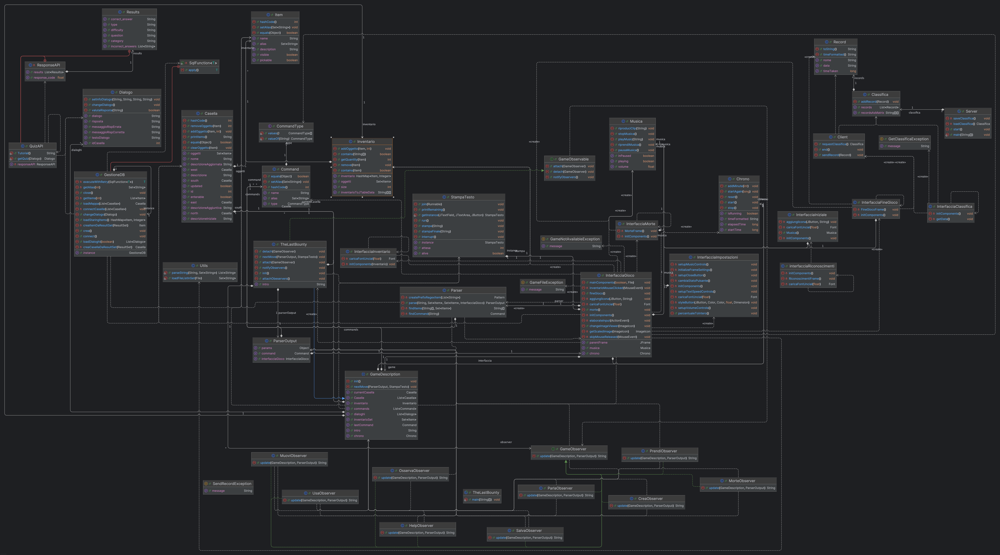

## 1 - Descrizione dell'avventura

The Last Bounty è un'avventura testuale. l'utente giocherà nei panni di un Cacciatore di taglie, il cui ultimo incarico è quello di uccidere un'entita molto putente mutata nei secoli

## 2 - Diagramma delle classi

Inserire una diagramma delle classi di una porzione significativa del progetto e commentare il diagramma fornendo dettagli sui principi della programmazione ad oggetti che sono stati utilizzati (ereditarietà, interfacce, classi astratte, composizione, …)

## 3 - Progettazione delle Classi

CLASSI

### Package Classifica

Il package Classifica Contiene 4 classi:

	1.	classificaClientRecordServer = Gestisce i dati del tempo e dell’utente quando viene una partita attraverso l’utilizzo del Client e del Server
	2.	Client = gestisce l’utente che sta giocando la partita
	3.	Record = Crea il record con nome utente, tempo impiegato per finire il gioco e data
	4.	Server. = avvia un server che aspetta che venga aggiunto il record

[Diagramma UML Package Classifica](./img/uml-classifica.png)

### Package Comandi
Il package Comandi contiene 2 classi

	1.	Command = attraverso l’implementazione di serializable gestisce i comandi che l’utente scrive
	2.	CommandType = Lista dei comandi disponibili all’interno del gioco

[Diagramma UML Package Comandi](./img/uml-comandi.png);

### Package Componenti Aggiuntivi
Il Package Componenti Aggiuntivi contiene 7 classi

	1.	Chrono = gestisce il tempo
	2.	GameDescription = gestisce le informazioni del gioco
	3.	GameObservable = gestisce l’osservazione del gioco ( quando non riceve input lo stato del gioco è in osservazione idle
	4.	GameObserver = gestisce gli observer del gioco
	5.	Musica = gestisce tutti i metodo della musica
	6.	StampaTesto = attraverso l’utilizzo dei thread gestisce come il thread viene stampato a video
	7.	Utils = legge i comandi ed elimina le stopwords
[Diagramma UML Package Componenti Aggiuntivi](./img/uml-componentiaggiuntivi.png);

### Package Database
Il Package Database contiene 3 classi

	1.	Casella = gestisce la casella le descrizioni e le coordinate
	2.	GestioneDB = carica il DB in GameDescription e si occupa della connessione tra le caselle
	3.	MondoDB.sql = database del gioco
[Diagramma UML Package Database](./img/uml-database.png);

### Package Eccezioni
Il Package Eccezioni contiene 4 classi

	1.	GameFileException = si occupa di lanciare un’eccezione se il file di salvataggio da caricare non esiste o è corrotto

	2.	GameNotAvailableException = stampa eccezione se c’è un errore nell’inizializzazione del gioco
	3.	GetClassificaException. = stampa eccezione se non riesce a salvare i dati nella classifica
	4.	SendRecordException = Stampa l’eccezione se non tra un server in ascolto oppure se il record inviato non arriva al server (gestisce l’invio del record al server)

### Package Giocatore
il Package Giocatore contiene 3 classi 

	1.	Dialogo = gestisce i dialoghi del gioco con gli NPC
	2.	Inventario = gestisce l’inventario del giocatore
	3.	Item = gestisce il tipo di item presente nel database

[Diagramma UML Package Giocatore](./img/uml-giocatore.png);

### Package Grafica
Il Package Grafica contiene 8 classi

	1.	InterfacciaClassifica = gestisce l’interfaccia della classifica
	2.	InterfacciaFineGioco = gestisce l’interfaccia di Fine Gioco
	3.	InterfacciaGioco. = Gestisce l’interfaccia di gioco
	4.	InterfacciaImpostazioni =Gestisce l’interfaccia delle impostazioni
	5.	InterfacciaInventario = gestisce l’interfaccia dell’inventario
	6.	InterfacciaIniziale = gestisce l’interfaccia della schermata iniziale
	7.	InterfacciaRiconoscimenti = gestisce l’interfaccia dei riconoscimenti
	8.	InterfacciaMorte = gestisce l’interfaccia di morte

[Diagramma UML Package Grafica](./img/uml-grafica.png);

### Package Observer
Il Package Observer contiene 10 classi

	1.	CreaObserver = Gestisce il comando crea
	2.	HelpObserver = Gestisce il comando Help/Aiuto
	3.	MorteObserver = Gestisce il comando Muori o se il giocatore muore all’interno di una partita
	4.	MuoviObserver = gestisce il movimento del giocatore
	5.	OsservaObserver = gestisce il comando osserva che il giocatore può fare in una stanza o su un oggetto
	6.	ParlaObserver = gestisce le interazioni con gli NPC
	7.	PrendiObserver = gestisce il comando prendi degli ITEM
	8.	SalvaObserver = gestisce il comando slava per i salvataggi del gioco
	9.	UsaObserver = gestisce il comando usa per gli oggetti del gioco
	10.	TheLastBounty = gestisce l’aggiunta e la creazione di tutti gli observer con i vari comandi

[Diagramma UML Package Observer](./img/uml-observer.png);

### Package Parser
Il Package Parser contiene 2 classi

	1.	Parser = gestisce l’input dell’utente e lo trasforma in eventuali comandi
	2.	ParserOutput = una volta gestito l’input dell’utente mostra a video il risultato

[Diagramma UML Package Parser](./img/uml-parser.png);

### Package Rest
Il Package Rest contiene 1 classe

	1.	QuizAPI = gestisce il dialogo speciale grazie all’utilizzo delle RESTFul per prendere da un sito esterno domande sulla mitologia ponendole al giocatore come fosse un quiz

[Diagramma UML Package Rest](./img/uml-rest.png);

### Package Thelastbounty
Il Package thelastbounty contiene 1 classe

	1.	TheLastBounty = gestisce l’avvio del programma

## 4 - Specifiche Algebriche
La struttura più utilizzata nel nostro progetto è la **Mappa**, in questa sezione viene presentata la sua specificha algebrica.

#### Specifica algebrica della Mappa

- La mappa è una struttura dati che associa una chiave ad un valore, permettendo di memorizzare e recuperare informazioni in modo efficiente.

#### Specifica sintattica
<table>
    <thead>
        <tr>
            <th colspan="2">Tipi</th>
        </tr>
    </thead>
    <tbody>
        <tr>
            <td colspan="2">Map, Key, Value, Boolean, Integer</td>
        </tr>
        <tr>
            <td colspan="2"><strong>Operatori</strong></td>
        </tr>
        <tr>
            <td><code>newMap() -> Map</code></td>
            <td>Crea una nuova mappa vuota</td>
        </tr>
        <tr>
            <td><code>isEmpty(Map) -> Boolean</code></td>
            <td>Restituisce <code>true</code> se la mappa è vuota, <code>false</code> altrimenti</td>
        </tr>
        <tr>
            <td><code>put(Map, Key, Value) -> Map</code></td>
            <td>Aggiunge una coppia chiave-valore alla mappa, o, se già presente, ne aggiorna il valore</td>
        </tr>
        <tr>
            <td><code>get(Map, Key) -> Value</code></td>
            <td>Restituisce il valore associato alla chiave specificata</td>
        </tr>
        <tr>
            <td><code>containsKey(Map, Key) -> Boolean</code></td>
            <td>Restituisce <code>true</code> se la chiave specificata è presente nella mappa</td>
        </tr> 
        <tr>
            <td><code>containsValue(Map, Value) -> Boolean</code></td>
            <td>Restituisce <code>true</code> se il valore specificato è presente nella mappa</td> 
        </tr>
        <tr>
            <td><code>remove(Map, Key) -> Map</code></td>
            <td>Rimuove la chiave ed il valore associato ad essa dalla mappa</td>
        </tr> 
        <tr>
            <td><code>size(map) -> Integer</code></td>
            <td>Restituisce il numero di coppie chiave-valore presenti nella mappa</td>  
        </tr>
    </tbody>
</table>

##### Osservazioni e Costruttori

<table>
  <thead>
    <tr>
      <th></th>
      <th colspan="2">Costruttori di m'</th>
    </tr>
  </thead>
  <tbody align="center">
    <tr>
      <td><strong>Osservazioni</strong></td>
      <td><code>newMap</code></td>
      <td><code>put(m, k, v)</code></td>
    </tr>
    <tr>
      <td><code>isEmpty(m')</code></td>
      <td><code>true</code></td>
      <td><code>false</code></td>
    </tr>
    <tr>
      <td><code>containsKey(m', k')</code></td>
      <td><code>false</code></td>
      <td>if <code>k = k'</code> then <code>true</code> else <code>containsKey(m, k')</code></td>
    </tr>
    <tr>
      <td><code>containsValue(m', v')</code></td>
      <td><code>false</code></td>
      <td>if <code>v = v'</code> then <code>true</code> else <code>containsValue(m, v')</code></td>
    </tr>
    <tr>
      <td><code>get(m', k')</code></td>
      <td><code>error</code></td>
      <td>if <code>k = k'</code> then <code>v</code> else <code>get(m, k')</code></td>
    </tr>
    <tr>
      <td><code>remove(m', k')</code></td>
      <td><code>error</code></td>
      <td>if <code>k = k'</code> then <code>m</code> else <code>put(remove(m, k'), k, v)</code></td>
    </tr>
    <tr>
      <td><code>size(m')</code></td>
      <td><code>0</code></td>
      <td>if <code>containsKey(m, k)</code> then <code>size(m)</code> else <code>size(m) + 1</code></td>
    </tr>
  </tbody>
</table>

#### Specifica semantica

- **DECLARE**
  - <code>m</code>, <code>m'</code>: <code>Map</code>
  - <code>k</code>, <code>k'</code>: <code>Key</code>
  - <code>v</code>, <code>v'</code>: <code>Value</code>

- **OPERATIONS**
  - <code>isEmpty(newMap)</code> = <code>true</code>
  - <code>isEmpty(put(m, k, v))</code> = <code>false</code>
  - <code>containsKey(newMap, k')</code> = <code>false</code>
  - <code>containsKey(put(m, k, v), k')</code> = if <code>k = k'</code> then <code>true</code> else <code>containsKey(m, k')</code>
  - <code>containsValue(newMap, v')</code> = <code>false</code>
  - <code>containsValue(put(m, k, v), v')</code> = if <code>v = v'</code> then <code>true</code> else <code>containsValue(m, v')</code>
  - <code>get(put(m, k, v), k')</code> = if <code>k = k'</code> then <code>v</code> else <code>get(m, k')</code>
  - <code>remove(put(m, k, v), k')</code> = if <code>k = k'</code> then <code>m</code> else <code>put(remove(m, k'), k, v)</code>
  - <code>size(newMap)</code> = <code>0</code>
  - <code>size(put(m, k, v))</code> = if <code>containsKey(m, k)</code> then <code>size(m)</code> else <code>size(m) + 1</code>

#### Specifica di restrizione

- **RESTRICTIONS**
  - <code>get(newMap, k')</code> = <code>error</code>
  - <code>remove(newMap, k')</code> = <code>error</code>

## 5 - Dettagli Implementativi

### Clicca [qui](./argomenti_del_corso.md) per visualizzare il file contenente i dettagli implementativi

## eliminare quanto sotto
Dettagli implementativi
Per ciascun argomento del corso spiegare se e come è stato utilizzato all’interno del progetto.
Programmazione generica
bla bla bla…
File
bla bla bla…
Database (JDBC)
bla bla bla…
Lamba Expression (compresi stream e pipeline)
bla bla bla…
SWING
bla bla bla…
Thread e programmazione concorrente
bla bla bla…
Socket e/o REST
bla bla bla…

La struttura del documento è solo un suggerimento. È possibile modificarla purché il documento contenga le informazioni richieste. È possibile inserire altre sezioni, ad esempio: soluzione del gioco, dettagli sull’organizzazione del lavoro di gruppo, ecc…
Note sulla valutazione

Il caso di studio verrà valutato in una scala da 0 a 50. Il voto finale verrà rapportato in trentesimi.

Il voto è determinato da 10 criteri, ognuno dei quali può avere un voto tra 0 e 5. I criteri sono:
qualità dell’avventura
qualità della programmazione ad oggetti
utilizzo dei file
utilizzo di database/JDBC
utilizzo dei thread e della programmazione concorrente
utilizzo delle socket e/o delle REST
utilizzo delle SWING
utilizzo delle lambda expression, stream e pipeline
qualità della documentazione (documentazione progetto + documentazione codice)
punteggio bonus che tiene conto della complessità del progetto rapportata anche al numero dei componenti del gruppo

Tutto il materiale deve essere consegnato 5 giorni prima della prova orale. Deve essere consegnato tramite mail allegando uno zip o un link per il download. Il testo della mail deve riportare in modo chiaro tutti i membri del gruppo.
Svolgimento della prova orale
Ogni gruppo presenterà il caso di studio e una demo live dell’avventura realizzata per un tempo massimo di 20 minuti. È possibile preparare delle slide, ma non è obbligatorio. Al termine della presentazione, ogni membro del gruppo sarà interrogato su tutti gli argomenti del corso.

Il voto finale terrà conto sia della valutazione del caso di studio sia della qualità della prova orale.

Le note sulla valutazione e lo svolgimento della prova vanno eliminate dal documento che verrà consegnato.

